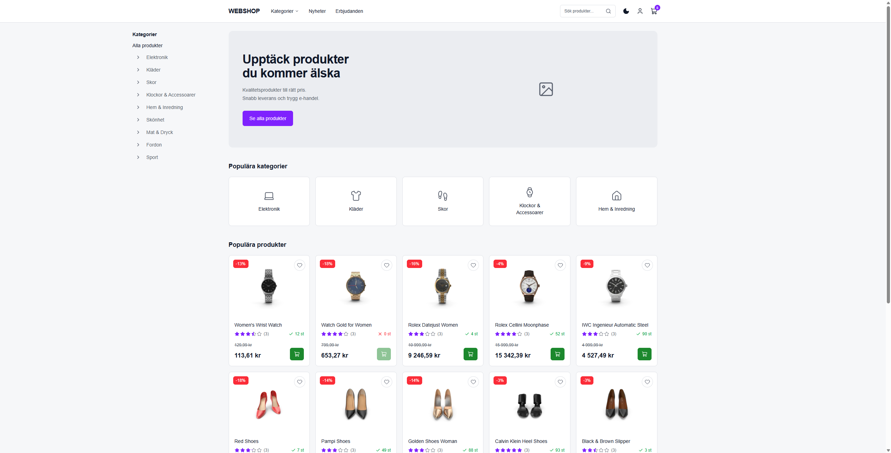

# Webshop Customer Site

A responsive customer-facing webshop built with Next.js, TypeScript and Tailwind CSS.

## Screenshot



## Features

- Responsive homepage and navigation
- Category and subcategory browsing
- Product listing with infinite scrolling
- Product filtering by stock, price, rating and brand
- Product sorting by price, rating, discount and name
- Product detail pages with image gallery, specifications and reviews
- Shopping cart with quantity controls, item removal and cart persistence
- Cart subtotal, VAT information and discount savings
- Light and dark theme
- Responsive mobile navigation and cart drawer

## Tech Stack

- Next.js 16.2.10
- React 19.2.4
- TypeScript
- Tailwind CSS v4
- JSON Server
- npm

### Libraries

- Lucide React - icons
- Yet Another React Lightbox - product image gallery
- @teispace/next-themes - light/dark theme handling
- Concurrently — runs the application and mock API together

## Project Structure

The application uses the Next.js App Router.

```text
app/          Next.js routes, layouts and global styles
components/   Reusable UI components
services/     API service modules
lib/          Shared utilities and storefront configuration
public/       Static assets
server/       Mock API/server configuration
```

Main routes:

```text
/                  Homepage
/products          Product listing
/products/[id]     Product details
```

## Installation

### Prerequisites

- Node.js
- npm

### Setup

Clone the repository:

```bash
git clone YOUR_REPOSITORY_URL
cd YOUR_REPOSITORY_NAME
```

Install dependencies:

```bash
npm install
```

Start the development server:

```bash
npm run dev
```

The customer webshop runs on:

```text
http://localhost:3001
```

The mock API must be running separately on:

```text
http://localhost:4000
```

## API

The webshop uses JSON Server as a local mock API.

API endpoint:

```text
http://localhost:4000
```

The API provides the product and category data used by the customer webshop.

## Build

Create a production build:

```bash
npm run build
```

Start the production server:

```bash
npm run start
```

## Known Limitations

- The application uses a local JSON Server mock API.
- Checkout and payment processing are simulated.
- User accounts and authentication are not implemented.
- Orders are not persisted.
- The application does not use a production backend.
